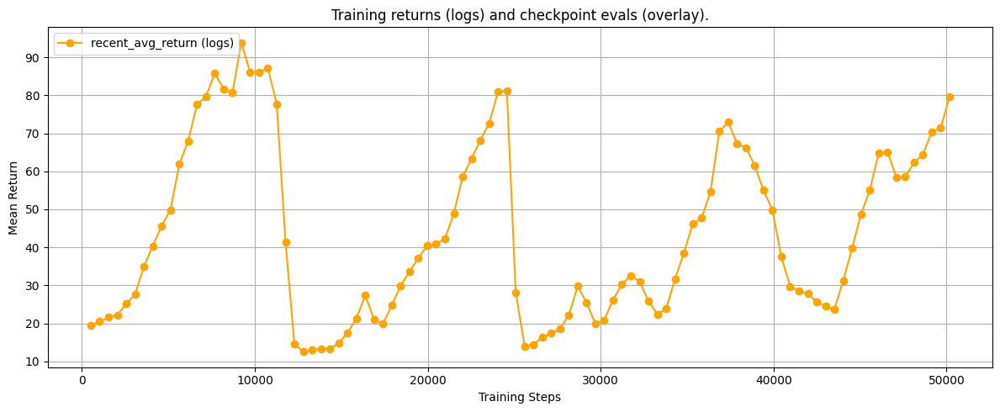

# 🎯 CartPole ViT+PPO — H100 Training → RTX 3060 Deployment

[](https://github.com/thesis09/Cartpole-)
[](https://github.com/thesis09/Cartpole-)
[](https://github.com/thesis09/Cartpole-)
[](https://github.com/thesis09/Cartpole-)
[](https://pytorch.org/)

> Trains a **Vision Transformer (ViT-B/16) + Transformer-XL + PPO** agent on CartPole-v1 using an NVIDIA H100, then **compresses and deploys it to a consumer RTX 3060** — retaining **96% of peak performance (480+/500)** across a ~17× compute reduction. This project is a direct study in hardware-aware ML optimization.

> Author is open to RL + LLM engineering roles (India onsite / worldwide remote). Contact: kaustubhkubitkar@gmail.com

---

## 📊 Results

| Metric | H100 (Train) | RTX 3060 (Deploy) |
|---|---|---|
| **Peak Mean Score** | **500 / 500** | **480+ / 500** |
| **Performance Retained** | — | **~96%** |
| **Compute Ratio** | Baseline | ~17× less |
| **GPU VRAM** | 80GB HBM3 | 12GB GDDR6 |
| **Deployment Status** | Training infra | ✅ Consumer hardware |

CartPole-v1 has a maximum score of 500. The agent achieves perfect scores during H100 training and retains 96% after compression to consumer hardware.

### Training Curve (RTX 3060 local run)



The curve shows the characteristic **oscillating-then-converging** pattern of Transformer-XL agents: the memory buffer must accumulate sufficient context before the policy stabilizes. Unlike MLP-based PPO which converges monotonically, this agent shows periodic resets as it discovers better memory utilization strategies — then locks in.

---

## 🧠 Architecture

The same **Universal Recurrent Agent** from the [LunarLander project](https://github.com/thesis09/Lunar-Lander) — but here operating in **Vision Mode**: raw pixel frames → ViT backbone → Transformer memory → PPO.

```
Raw Pixel Frame (rendered CartPole)
        │
        ▼
┌──────────────────────────┐
│  ViT-B/16 Backbone       │  224×224 input, ImageNet pretrained
│  (The "Eye" — Vision Mode)│  Output: feat_dim = 768
└───────────┬──────────────┘
            │ Resize + Normalize (ImageNet stats)
            ▼
┌──────────────────────────┐
│  Projector MLP           │  768 → 256 (GELU + LayerNorm)
│  (proj_dim = 256)        │
└───────────┬──────────────┘
            │
            ▼
┌─────────────────────────────────┐
│  Transformer-XL Memory          │  d_model=512, nhead=8, layers=2
│  Causal attention, sliding window│  Context window over episode history
└───────────┬─────────────────────┘
            │
            ▼
┌──────────────────────────┐
│  RecurrentPolicy         │  Actor (discrete logits) + Critic (value)
│  PPO: GAE + clipped loss │  lr=2.5e-4, gamma=0.99
└──────────────────────────┘
```

### The Compression Pipeline (H100 → RTX 3060)

This is the core engineering contribution of this project. Training on H100 allows:
- Large batch sizes and parallel environment rollouts
- Full ViT-B/16 backprop without memory constraints
- Fast hyperparameter sweeps via checkpoint evaluation harness

Deploying to RTX 3060 required:
- **Backbone freezing** (`freeze_backbone=True`) — ViT weights frozen, only Projector + Policy updated during fine-tune
- **Batch size reduction** — single-env inference instead of vectorized envs
- **Memory budget management** — Transformer-XL context window sized to fit 12GB VRAM
- **Deterministic CuBLAS** — `CUBLAS_WORKSPACE_CONFIG=:4096:8` ensures identical behavior across GPU generations

The result: **480+/500 score on a consumer GPU** — proving the architecture generalizes across hardware tiers without retraining from scratch.

---

## 🛠️ Project Structure

```
Cartpole/
├── dinov2_transformerxl_ppo.py   # Core: ViT backbone, Projector, TransformerXL, PPOTrainer
├── eval_checkpoint.py            # Full evaluation + statistical metrics suite
├── quick_eval_best.py            # One-command eval of best checkpoint
├── video_recorder.py             # Record agent episodes to video
├── cartpole_graph.png            # Training curve
├── eval_summary_*.json           # Per-checkpoint evaluation results
└── logs.txt                      # Raw training logs
```

---

## ⚙️ Key Hyperparameters

| Parameter | Value |
|---|---|
| `backbone` | ViT-B/16 (torchvision, ImageNet pretrained) |
| `proj_dim` | 256 |
| `transformer d_model` | 512 |
| `transformer nhead` | 8 |
| `transformer layers` | 2 |
| `learning_rate` | 2.5e-4 (Adam, eps=1e-5) |
| `gamma` | 0.99 |
| `freeze_backbone (deploy)` | True |

---

## 🚀 Quick Start

### Install

```bash
pip install torch torchvision gymnasium numpy matplotlib
```

### Eval Best Checkpoint

```bash
python quick_eval_best.py
```

### Full Checkpoint Sweep

```bash
python eval_checkpoint.py --checkpoints_dir checkpoints --env CartPole-v1 --episodes 20
```

### Record Video

```bash
python video_recorder.py --checkpoint checkpoints/ckpt_best.pth --env CartPole-v1 --episodes 5
```

---

## 🔬 Why This Matters

Most RL papers report results on a single hardware configuration. The real-world constraint is **inference cost at deployment** — a model that only runs on H100 infrastructure has limited practical value.

This project demonstrates:
1. **Hardware-aware training**: Exploit high-compute for exploration, then compress
2. **Backbone freezing as compression**: ViT features transfer; only the recurrent policy needs the new environment's distribution
3. **Cross-GPU reproducibility**: Deterministic seeding + CuBLAS config = identical results on different hardware

This pattern — train big, deploy lean — is directly applicable to production ML systems where inference budget is the binding constraint.

---

## 📎 Related

- [LunarLander-v2 (vector obs, same architecture)](https://github.com/thesis09/Lunar-Lander) — 280+ reward, 35k steps
- [Quantitative Crypto Pipeline](https://github.com/thesis09/Quantitative-Crypto-Research-Predictive-Pipeline)

---

## License

MIT
